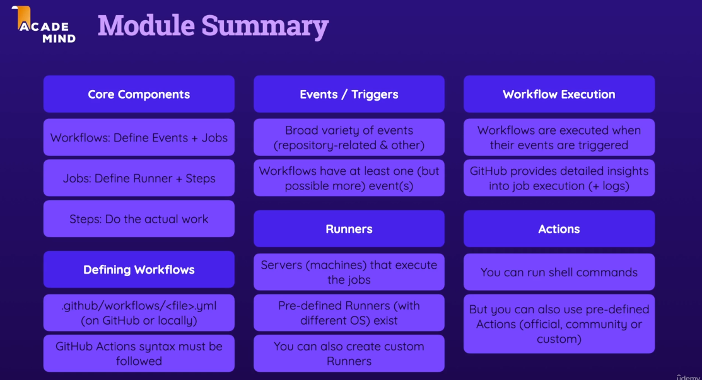
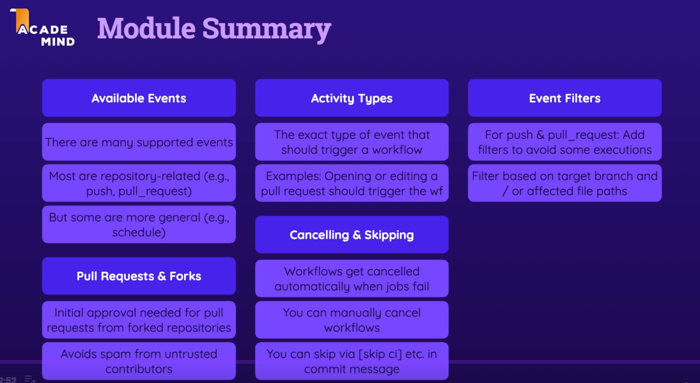

# Learn github actions
## Section 3: GitHub Actions - basic building Blocks & Components 
### Key components
- workflow - susijusios su repositorijom ir galima ju turet kiek norima.
- job - workflow turi jobsus, ir gali ju tureti kiek tik iseina. jobsai by default runnin a paraleliai, gali but conditional
- step - jobsas turi 1 ar daugiau stepsu. executina shelcript arba actions. runina vinas po kito ir gali but conditional

runinamas skriptas per multiple lines.
```sh
run: |
    echo "First output"
    echo "Second output"
```

```yaml
# yra daugybe eventu push, pull_request, create, fork, issue ir t.t. repository_dispache, schedule, workwlow_call skaityti spec ka daro kuri https://docs.github.com/en/actions/reference/events-that-trigger-workflows
on: workflow_dispatch #this mean manually started

on:
  pull_request:
    types: [opened, reopened] # dar yra tipai
jobs:
  test:
    runs-on: ubuntu-latest # cia isivaizduoti kaip serveri, cia jau sitam runeryje node js instaliuota tai zinoma is spec jei nebutu reiktu tada naudoti kita stepsa ir ieskoti set up node js actiono market place.
    steps:
      - name: Get code
        uses: actions/checkout@v4       #actionams
      - name: Print good-bye
        run: echo "Done Stepsas" #scriptams
```

Actions istikruju yra workflows. action yra yra custom aplicaija kuri atlieka kazkoki taska pvz parsipulina koda. galima sukurti savo actionus arba naudoti comuniti.

### summary of the module 
 

## Section 4: workflows & events - deep dive

jei puul request trigeris uzsetintas bet nieko daugiau nesukonfiginta , tada trigerinsis by default. ant: open, sunchronize ir reopened activity tipu.

branches-ignore: eidzia specifikuoti kuriuos igoruoti. yra dar tags-ignore: veikia panasiai. paths/paths-ignore: .negalima abieju iskart paths ir paths-ignore.

Pullrequest based on fork. netrigerina workflows turi but approvinta jei viskas qualifilina. jei naudojamas trigeris "pull_request_target" tada nereikia approvint bet gali but saugumo spragu. Udemy kursas sako kad bus executinama jei karta jau approvinta GPT sako kad ne.

### canceling and skipping workflows runs

jei jobs fails workflows cancelinama. jei vienas is stepsu failina failina jobs tuo paciu workflow cancelinama. gali butu cancelinama manually. UI nuejus i workflow resti "Cancel workwlow" button.

Skipinti galima su specialiais komentarais komite pvz git commit -m "added comment [skip ci]" rezervuotas komneto keywordas"[skip ci]" daugiau apie skipinima cia: https://docs.github.com/en/actions/how-tos/managing-workflow-runs-and-deployments/managing-workflow-runs/skipping-workflow-runs

### module summary


## Section 5: job artifacts & outputs
### job artifacts - cia galetu but executable file, containers, mobile app package files, webo failai kurie talpinami. Cia taip vadinami aftifactais. taigi jobas gali pagaminti tuos aftifactus ir kazkur storinti gali kitas jobas naudoti tuos artifaktus. Outputai is jobo. nebutinai binaries bet gali but log failais. bet cia failai ir folderiai pagaminti JOBO kuries bus(gali buti) naudojami kituose JOBUOSE arba manualy(automaticaly) inspected. g

cia artifaktu upload stepsas. ten path turi sutamp jei lokaliai darai  built ir kazkur storinami build failai pvz dist foldery ar dotnet bin foldery. Tai reik ir nurodyt ta folderi kur bus sukurtas runeryje.
```yaml
- name: Upload build artifacts
  uses: actions/upload-artifact@v4
  with:
    name: react-dist-files
    #komnetarai path: | negalimi. failina buildas
    path: |
      Section5/react/dist
      Section5/react/package.json
```
